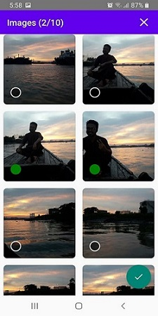

# ProPicker

A simple library to select images from the gallery and camera.

Step 1. Add the JitPack repository to your build file

```
allprojects {
    repositories {
        maven { url "https://jitpack.io" }
    }
}
```

Step 2. Add the dependency

```
dependencies {
    implementation 'com.github.shaon2016:ProPicker:0.1.2'
}

```

# To working with this library you have to do the below work.......
 
Add this permissions in your androidManifest.xml file

```
    <uses-permission android:name="android.permission.READ_EXTERNAL_STORAGE" />
    <uses-permission android:name="android.permission.WRITE_EXTERNAL_STORAGE" />

    <uses-feature android:name="android.hardware.camera.any" />

    <uses-permission android:name="android.permission.CAMERA" />
    
```

Add this in your build.gradle app module

```
android {

    //.........
    
    kotlinOptions {
        jvmTarget = "1.8"
    }

    compileOptions {
        sourceCompatibility JavaVersion.VERSION_1_8
        targetCompatibility JavaVersion.VERSION_1_8
    }

    buildFeatures {
        dataBinding true
    }

}
```

# Screenshot


      

## Start Pro image picker activity

The simplest way to start 

```
            ProImagePicker.with(this)
                .start { resultCode, data ->
                    if (resultCode == RESULT_OK && data != null) {
                        val imageFiles = ProImagePicker.getImages(data)

                        if (imageFiles.size > 0) {
                            iv.setImageURI(imageFiles[0].contentUri)
                        }
                    }
                }
```

What you can do with ImagePicker

Camera

```
            ProImagePicker.with(this)
                .cameraOnly()
                .crop()
                .start { resultCode, data ->
                    if (resultCode == RESULT_OK && data != null) {
                        val imageUri = ProImagePicker.getCapturedImageUri(data)

                        iv.setImageURI(imageUri)

                    }
                }
```

Gallery

```
            ProImagePicker.with(this)
                .galleryOnly()
                .multiSelection(10)
                .start { resultCode, data ->
                    if (resultCode == RESULT_OK && data != null) {

                        val imageFiles = ProImagePicker.getImagesAsFile(this, data)
                        if (imageFiles.size > 0) {
                            Glide.with(this)
                                .load(imageFiles[0])
                                .into(iv)
                        }
                    }
                }
```

Function that offers this library

$ cameraOnly() -> To open the CameraX only
$ galleryOnly() -> To open the gallery view only
$ crop() -> Only works with camera
$ ProImagePicker.getImagesAsFile(this, intent) -> Returns all the images as File (Should not use in Android 10 or above)
$ ProImagePicker.getImagesAsByteArray(this, intent) -> Returns all the images as ByteArray (You should always use it. Using this function you can load image in imageview using Glide and you can upload images or videos to server using Retrofit library.
$ ProImagePicker.getCapturedImageFile(intent)
$ ProImagePicker.getCapturedImageUri(intent)
$ ProImagePicker.getImages(intent: Intent) -> Get all the images 
