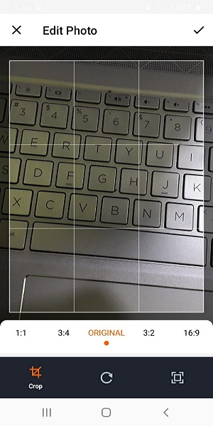

# ProPicker

A simple library to select images from the gallery and camera. 

There are many libraries out there. May be some serves your purposes but not satisfactory. This library is different from the others.

Why should you use it? 

* CameraX library to capture images. 
* It also uses UCrop library to crop images. 
* It uses best compression to compress your image without loosing image's quality.


Step 1. Add the JitPack repository to your build file

```
allprojects {
    repositories {
        maven { url "https://jitpack.io" }
    }
}
```

Step 2. Add the dependency

```
dependencies {
    implementation 'com.github.shaon2016:ProPicker:0.1.5'
}

```

# To working with this library you have to do the below work.......
 

Add this in your build.gradle app module

```
android {

    //.........
    
    kotlinOptions {
        jvmTarget = "1.8"
    }

    compileOptions {
        sourceCompatibility JavaVersion.VERSION_1_8
        targetCompatibility JavaVersion.VERSION_1_8
    }

    buildFeatures {
        dataBinding true
    }

}
```

# Screenshot


      

## Start Pro image picker activity

The simplest way to start 

```
            ProPicker.with(this)
                .start { resultCode, data ->
                    if (resultCode == RESULT_OK && data != null) {
                        val list = ProPicker.getSelectedPickerDatas(data)

                        if (list.size > 0) {
                            iv.setImageURI(list[0].uri)
                        }
                    }
                }
```

What you can do with ImagePicker

Camera

```
            ProPicker.with(this)
                .cameraOnly()
                .crop()
                .start { resultCode, data ->
                    if (resultCode == RESULT_OK && data != null) {
                        val picker = ProPicker.getPickerData(data)

                        iv.setImageURI(picker?.uri)

                    }
                }
```

Gallery

```
            ProPicker.with(this)
                .galleryOnly()
                .start { resultCode, data ->
                    if (resultCode == RESULT_OK && data != null) {
                        val list = ProPicker.getSelectedPickerDatas(data)
                        if (list.size > 0) {
                            Glide.with(this)
                                .load(list[0].file)
                                .into(iv)
                        }
                    }
                }
```

##### Function that offers this library

## For Camera

1. cameraOnly() -> To open the CameraX only
3. crop() -> Only works with camera
3. compressImage -> compresing image work for both gallery and camera


## Gallery related function
4. galleryOnly() -> To open the gallery view only
5. singleSelection -> Pick single file
6. multiSelection -> Pick multi file and get the result as ArrayList    
7. maxResultSize -> Max Width and Height of final image
8. compressImage -> compresing image work for both gallery and camera
9. compressVideo -> (Under Development)
10. onlyImage -> Select image from gallery
11. onlyVideo -> Select video from gallery

## Receiver the result

12. ProPicker.getPickerDataAsByteArray(this, intent) -> Returns all the data as ByteArray 
13. ProPicker.getSelectedPickerDatas(intent: Intent) -> Get all the data 
14. ProPicker.getPickerData(intent: Intent) -> Get single data 
